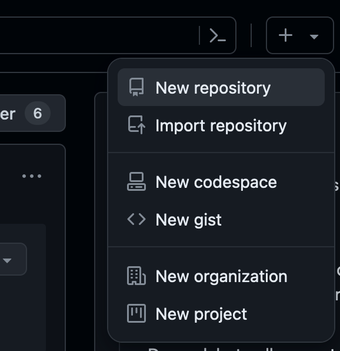
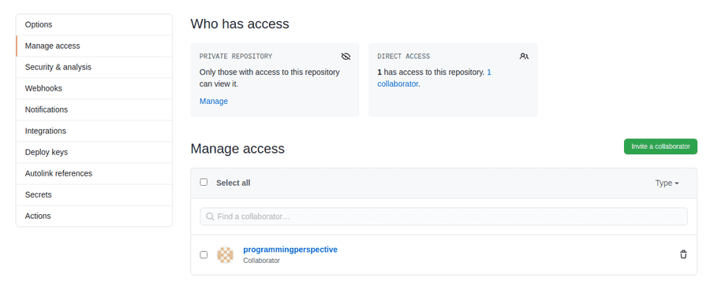
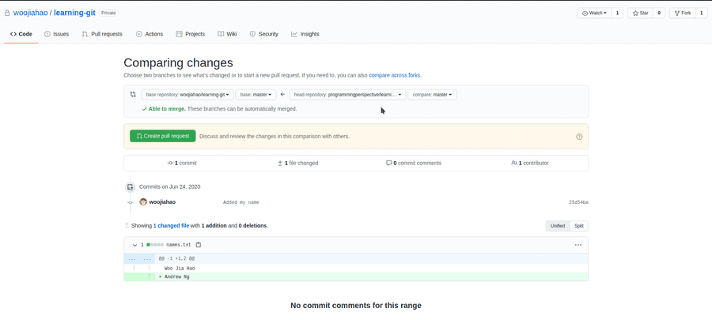
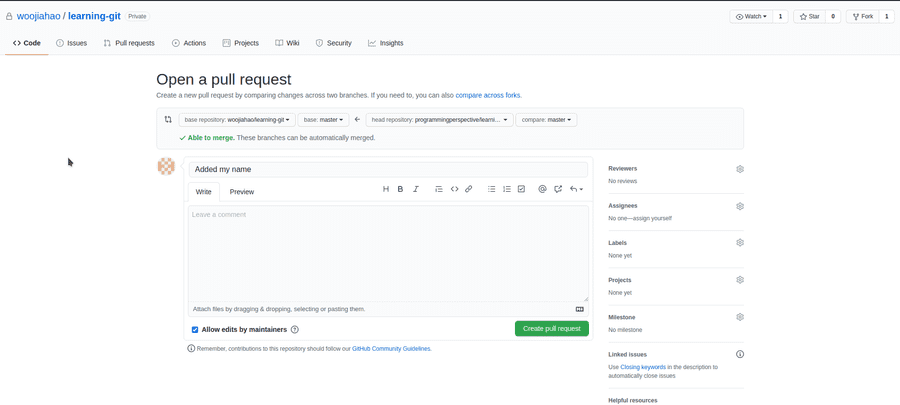
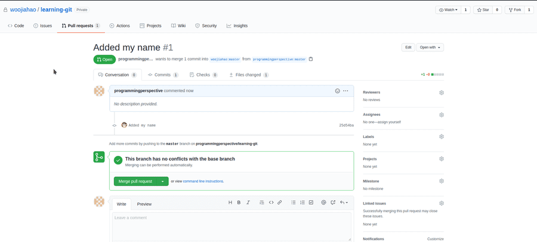

% Introduction to Git (and GitHub)
% [{.logo-img style="height: 5ex;"}](https://nushackers.org){target="_blank"}
% 5th Sep, 2023

---

## Slides

[https://hckr.cc/orbital24-git-slides](https://hckr.cc/orbital24-git-slides)

---

## Setup Issues

Quick check: Did anyone face any problems setting up Git on your machine or creating an account on
GitHub?

---

## Things you need


[{.logo-img style="height: 5ex;"}](https://git-scm.com)

[{.logo-img style="height: 5ex;"}](https://github.com)

---

## What is **version control** and why should you care?

- A **version control system (VCS)** helps to record changes to a file or a set of files over time
- It allows you to revert a project to a previous state, or to compare changes over time
- Acts as an "undo" button for your code and lets your collaborate with your team

---

## What is Git?

- Created by Linus Torvalds in 2005 as a replacement for existing VCS for the Linux kernel
- A distributed version control system (DVCS)
- Every commit is a *snapshot* of your files
- GitHub != Git

{.white-bg}

---

## The three \"areas\"

- Working directory: where you actually work
- Index/\"staging\" area: where you construct a commit
- Repository/commit: the repository itself

{.white-bg style="height: 15ex"}

---

## Getting started

In each commit, Git stores the author and committer\'s name and email

You need to configure Git:

```
git config --global user.name "Your Name"
git config --global user.email "your@email.com"
```

---

## Setting your editor

Git sometimes launches an editor e.g. when you `commit`, to edit the
commit message

Configure your favourite editor:
```
git config --global core.editor nano
git config --global core.editor emacs
# VS Code
git config --global core.editor "code --wait --new-window"
# For Windows
git config --global core.editor "'C:/Program Files/Notepad++/notepad++.exe' -multiInst -nosession"
git config --global core.editor "'C:/Program Files/Microsoft VS Code/code.exe' -n -w"
```

Now, we will create a new repository for this session.

---

## Allowing your local machine to access your GitHub account

This can be done by setting up an SSH key or an HTTPS Personal Access Token (PAT)

---

## Setting up a PAT

PATs are used to provide access to repositories with finer control/settings.

You can learn more about them [here](https://docs.github.com/en/authentication/keeping-your-account-and-data-secure/creating-a-personal-access-token)

---

## Creating a new GitHub repository

<!-- TODO: Use new image -->


---

## Creating a new GitHub repository

<!-- TODO: Use new image -->


---

## Creating a new GitHub repository

<!-- TODO: Use new image -->
{style="height: 22ex;"}

---

## Cloning the repository

Downloading a local copy of the repository

```
git clone https://github.com/<your GitHub username>/learning-git.git
```
The server (i.e. GitHub) stores the remote copy (like a single source of truth)


---

## Initialising a repository

Let\'s create a new Git repository.

```
$ mkdir my-git-repo
$ cd my-git-repo
$ git init
Initialized empty Git repository in my-git-repo/.git/
```

---

## Stage a file

Create a new file in `hello.txt`, however you want. Then add it:

```
$ echo 'Hello world' > hello.txt
$ git add hello.txt
```

Staging tells Git that you want to include the file in your next snapshot.

---

## Check the status

We\'ve just staged a file! So what is the state of the repository?

```
$ git status
```

```
On branch master

No commits yet

Changes to be committed:
    (use "git rm --cached <file>..." to unstage)

    new file:   hello
```

---

## Make your first commit

Committing files is taking the snapshot of the files that have been staged.

```
$ git commit -m "Add hello"
```

```
[master (root-commit) 5d74ce3] Add hello
    1 file changed, 1 insertion(+)
    create mode 100644 hello
```

You can leave the `-m ...` part out. Git will open your editor
for you to compose a commit message.

---

## Push your changes to GitHub
After committing your changes, you can now `push` these changes to GitHub
```
$ git push origin main
```
`origin` is a shorthand name for the remote repo that the project was
cloned from. It is used instead of the URL for convenience.


---

## Make some changes, and look at them
Make edits to `hello.txt` (or whatever file you made), then

```
$ git diff
```

```
diff --git a/hello b/hello
index 802992c..5d56d4d 100644
--- a/hello
+++ b/hello
@@ -1 +1 @@
-Hello world
+Hello Hackerschool!
```

`git diff` shows the changes to file content.

---

## Viewing commit history

```
$ git log
```

```
commit 19c32155172a20f2fd14fe0e6c0fea954c17296b (HEAD -> master)
Author: Your Name <your@email.com>
Date:   Sat May 8 21:36:58 2021 +0800

    Change world to Hackerschool!

commit dc37b1cb2627f9829db0072cfa7d3d6bf9eb6822
Author: Your Name <your@email.com>
Date:   Sat May 8 21:16:45 2021 +0800

    Add hello
```

---

## Summary so far

::: {.font75}
-   [`git init`](https://git-scm.com/docs/git-init): Initialise
    repository
-   [`git add`](https://git-scm.com/docs/git-add): Stage changes
-   [`git diff`](https://git-scm.com/docs/git-diff)` `[`(--staged)`](https://git-scm.com/docs/git-diff#Documentation/git-diff.txt-emgitdiffemltoptionsgt--ltpathgt82308203):
    Look at differences between working tree and index (`--staged`:
    index and current commit)
-   [`git status`](https://git-scm.com/docs/git-status): Look at
    repository status
-   [`git commit`](https://git-scm.com/docs/git-commit)` `[`(-m)`](https://git-scm.com/docs/git-commit#Documentation/git-commit.txt--mltmsggt):
    Commit staged changes (`-m`: with this commit message)
-   [`git show`](https://git-scm.com/docs/git-show): Show current commit
-   [`git log`](https://git-scm.com/docs/git-log): View the log
-   [`git push`](https://git-scm.com/docs/git-push): Push your branch to
    a remote

The commands\' manuals are linked. (They all have *many* more options
than what we\'ve covered.)

:::

---

## Intermission

5 minutes...

In the meantime, try out the commands that you have learnt! Add new files, edit them,
commit them, and stage them!

---

## Collaborating with others

---

## Collaboration Workflows

1. Branch & PR
2. Fork & PR

This workshop focuses on the former - "Branch & PR"

::: { .font50 }

For more information about "Fork & PR", you [can visit this link here](https://docs.github.com/en/pull-requests/collaborating-with-pull-requests/proposing-changes-to-your-work-with-pull-requests/creating-a-pull-request)

:::

## What is a branch?

A branch is an independent line of development, often used for features or bug fixes
that should not be directly and immediately saved onto the main branch


## What is a branch?

Main branch is the initial and primary place where most development occurs (`main` is traditionally used but can be named anything, used to be known as `master` branch)

## HEAD

`HEAD` is a special name given to the current commit of your current branch for ease of reference

{.white-bg style="height: 20ex;"}

---

## Why use branching?

::: {.font75}

-   work on **different versions of our code simultaneously**. Think of branches as alternative timelines.
-   create separate contexts where we can try new things or even **work on multiple ideas in parallel** without risking the codebase.
-   if feature A and feature B are being developed, if A breaks, it doesn't affect B.

:::

---

## Creating a branch

```
$ git checkout -b new-feature
Switched to a new branch 'new-feature'
```

Alternatively:

```
$ git branch new-feature
$ git checkout new-feature
Switched to branch 'new-feature'
```

---

## Creating a branch

{.white-bg}

---

## Listing branches

```
$ git branch
    main
* new-feature
```

---

## Changing branches

```
$ git checkout main
Switched to branch 'main'
```

---

## Branch & PR Workflow

Each member owns their copy of the repository locally (through cloning)

When working on a new feature or bug fix, each member will

---

## Branch & PR Workflow

1. Pull the latest changes from the remote repository
2. Create a branch per feature/bug fix on their local copy
3. Edit the files in their respective branch
4. Push their local branch to the repository
5. Make a pull request of their feature/bug fix branch to the `main` branch (remote copy)

---

## Hands-on Time!

---

## Setup

Add your teammate as a collaborator to your newly created GitHub repository (Settings > Manage access > Invite a collaborator)



---

## Setup

Clone their repository onto your machine (name it something different from your own):

```
$ git clone https://github.com/<your teammate's GitHub name>/my-new-repo.git my-friend-repo/
$ cd my-friend-repo/
```

---

## Creating a branch

```
$ git checkout -b feature-1
```

---

## Making your changes

Edit your friend's `hello.txt` to have whatever content you want and then stage and commit the file:

```
$ git add hello.txt
$ git commit -m "Update hello.txt"
```

---

## Pushing local changes to the remote repository

```
$ git push origin feature-1
```
`origin` is a shorthand name for the remote repo that the project was
cloned from. It is used instead of the URL for convenience.

---

## Opening a pull request on the repository

Repository page > Pull Requests > New pull request

{style="height: 12ex"}

---

## Creating pull request

Ensure that the `compare` branch is your local feature branch and `base` branch
is `main` branch

<!-- TODO: Add updated screenshot -->


---

## Creating pull request

Confirm pull request with "Create pull request"

<!-- TODO: Add updated screenshot -->


---

## Reviewing pull requests

Your repository > Pull Requests > Select your friend's pull request



View the commits and the files changed through the tabs.

---

## Accepting pull requests

If the files are in order, click "Merge pull request" to accept their changes into
your repository's `main` branch

---

## Getting latest remote copy on your local copy

```
git pull origin main
```

`origin` is a shorthand name for the remote repo that the project was
cloned from. It is used instead of the URL for convenience.

---

## Merging

Combining your branch to another branch


---

## Handling (merge) conflicts

Merge conflicts arise when the same line of code is changed across two commits
so there is a conflict in which to be used

---

## Simulating merge conflicts

In your repository, create branch `conflict-1` from `main` and edit the first line of `hello.txt`

```
$ git checkout -b conflict-1
```

Return to `main` and create another branch `conflict-2` from `main` and edit the first line of `hello.txt` again

```
$ git checkout main
$ git checkout -b conflict-2
```

---

## Merge conflicts

{.white-bg}

---

## Merge conflicts

Now, try to merge `conflict-1` and `conflict-2` into `main`.

```
$ git merge conflict-1
Updating b53e9cf..87a92c3
Fast-forward
    hello.txt | 2 +-
    1 file changed, 1 insertion(+), 1 deletion(-)
$ git merge conflict-2
Auto-merging hello.txt
CONFLICT (content): Merge conflict in hello.txt
Automatic merge failed; fix conflicts and then commit the result.
```

---

## Handling merge conflicts

```
$ git status
On branch master
Your branch is ahead of 'origin/master' by 1 commit.
(use "git push" to publish your local commits)

You have unmerged paths.
(fix conflicts and run "git commit")
(use "git merge --abort" to abort the merge)

Unmerged paths:
(use "git add <file>..." to mark resolution)

both modified:   hello.txt

no changes added to commit (use "git add" and/or "git commit -a")
```

---

## Handling merge conflicts

```
$ cat hello.txt
<<<<<<< HEAD
Goodbye!
=======
Farewell!
>>>>>>> conflict-2
```

[What we have in `main`]{.mark}

[What we want to merge in `conflict-2`]{.mark-red}

---

## Handling merge conflicts

<!-- TODO: MUST DEMO TO EXPLAIN -->
Edit `hello.txt` as such...

---

## Handling merge conflicts

{.white-bg}

---

## Summary

-   [`git checkout`](https://git-scm.com/docs/git-checkout): Checkout a
    branch (and also files, etc)
-   [`git merge`](https://git-scm.com/docs/git-merge): Merge a branch
-   [`git clone`](https://git-scm.com/docs/git-clone): Clone a remote
    repository
-   [`git remote`](https://git-scm.com/docs/git-remote): Manage remotes
-   [`git push`](https://git-scm.com/docs/git-push): Push your branch to
    a remote
-   [`git pull`](https://git-scm.com/docs/git-pull): Pull updates from a
    remote to your repository

---

## Intermission!

5 minute break and Q&A!

---

## Additional Notes

---

## Commit manipulation

---

## Revert

Undo accidental changes made

```
$ git log --graph --oneline
* d1f4fcc (HEAD -> master, origin/master, origin/HEAD) Add file3
* 643aec6 Update file to c
* 4ec21c7 Update file to b
* 055cab4 Initial commit
```

Suppose we want to revert [this]{.mark} commit.

---

## Revert

```
$ git revert 643aec6
[master 7b73baf] Revert "Update file to c"
    1 file changed, 1 insertion(+), 1 deletion(-)
$ git show
commit 7b73baf229e2b8db19bc594c450743b50adf649d (HEAD -> master)
Author: Your Name <your@email.com>
Date:   Tue May 11 01:21:31 2021 +0800

    Revert "Update file to c"

    This reverts commit 643aec6d2a1b4cd485d678886fc1cef25b15bee0.

diff --git a/file b/file
index f2ad6c7..6178079 100644
--- a/file
+++ b/file
@@ -1 +1 @@
-c
+b
```

---

## Reset

Undo `git add`.

```
$ echo e > file
$ git add file
$ git status
On branch master
Changes to be committed:
    (use "git restore --staged <file>..." to unstage)
    modified:   file
$ git reset file
Unstaged changes after reset:
M   file
$ git status
On branch master
Changes not staged for commit:
    (use "git add <file>..." to update what will be committed)
    (use "git restore <file>..." to discard changes in working directory)
    modified:   file
no changes added to commit (use "git add" and/or "git commit -a")
```

---

## Checkout

Undo changes to a file in the working tree.

```
$ echo e > file
$ git status
On branch master
Changes not staged for commit:
    (use "git add <file>..." to update what will be committed)
    (use "git restore <file>..." to discard changes in working directory)
    modified:   file

no changes added to commit (use "git add" and/or "git commit -a")
$ git checkout -- file
$ git status
On branch master
nothing to commit, working tree clean
```

---

## Summary

-   [`git revert`](https://git-scm.com/docs/git-revert): Revert a commit
-   [`git reset`](https://git-scm.com/docs/git-reset): Unstage files
-   [`git checkout`](https://git-scm.com/docs/git-checkout): Checkout
    files (and also a branch)
    commits

---

## Ignoring files

Sometimes we don\'t want Git to track a certain file

~~~ {.bash-strong}
$ touch ignore-me
$ git status
~~~
    On branch master
    Untracked files:
      (use "git add <file>..." to include in what will be committed)

        ignore-me

    nothing added to commit but untracked files present (use "git add" to track)
---

## Ignoring files

We can add it to `.gitignore`

~~~ {.bash-strong}
$ echo "/ignore-me" >> .gitignore
$ git status
~~~
    On branch master
    Untracked files:
      (use "git add <file>..." to include in what will be committed)

        .gitignore

    nothing added to commit but untracked files present (use "git add" to track)

`.gitignore` should be committed.

---

## Ignoring files

~~~ {.bash-strong}
$ git add .gitignore && git commit -m "Add .gitignore"
~~~
    [master 5ada1cf] Add .gitignore
     1 file changed, 1 insertion(+)
     create mode 100644 .gitignore
~~~ {.bash-strong}
$ git status
~~~
    On branch master
    nothing to commit, working tree clean
~~~ {.bash-strong}
$ git status --ignored
~~~
    On branch master
    Ignored files:
      (use "git add -f <file>..." to include in what will be committed)

        ignore-me

    nothing to commit, working tree clean

---

## What to ignore?

Typically, we ignore files like build artifacts and generated files that
are usually derived from the human-authored code in the repository. E.g.

-   dependency caches like `/node_modules`
-   compiled code like `.o`, `.pyc` files
-   build output directories like `/bin`, `/out`
-   runtime-generated files like log files
-   personal configuration files e.g. of your IDE

---


## `.gitignore` format

    /logs/*/*.log
    /logs/**/*.log
    **/logs
    **/logs/debug.log
    *.log
    /debug.log
    debug.log

[See the full pattern format.](https://git-scm.com/docs/gitignore#_pattern_format)

---

## HTTPS vs SSH

It doesn\'t really matter.

Use HTTPS if you don\'t have an SSH key set up with GitHub, or if it is
a repository that you cannot write to.

Use SSH if you have an SSH key set up, and you can write to the
repository.

---

## Or it kinda does

::: { .font75 }
Using your GitHub password is no longer allowed after **August 13, 2021**. If you use HTTPS, you'll need to create a Personal Access Token (PAT).

In your GitHub account, go to

`Settings > Developer Settings > Personal Access Token`

to generate one.

:::

---

## Or does it?

Some enteprise network/universities may block SSH connections. However, you can try using SSH over HTTPS port (443).

    $ ssh -T -p 443 git@ssh.github.com
    > Hi USERNAME! You've successfully authenticated, but GitHub does not
    > provide shell access.

---

## Or does it?

If you get the success message, you can proceed to set SSH over HTTPS as a default connection by adding this to your `.ssh/config`

    Host github.com
    Hostname ssh.github.com
    Port 443
    User git

---

## Commit message discipline

First line: 80-character title, phrased imperatively

Then if your change is complex, elaborate on the change in prose.

``` font45
Change greeting from "Hi" to "Hello"

"Hi" is a bit too informal for a greeting. We should change it to "Hello" instead,
so that our users don't feel like we are being too informal. Blah blah blah blah.
Blah blah.
```

## Forking and PR setup

Clone this repository:
[fork-me](https://github.com/hackerschool-git/fork-me).

    $ git clone https://github.com/hackerschool-git/fork-me.git
    Cloning into 'fork-me'...
    remote: Enumerating objects: 3, done.
    remote: Counting objects: 100% (3/3), done.
    remote: Total 3 (delta 0), reused 3 (delta 0), pack-reused 0
    Unpacking objects: 100% (3/3), done.

---

## Forking and PR

You\'ve made some improvements, and now you want it upstreamed!

    $ cd fork-me/
    $ nano hello # Edit hello
    $ git add hello && git commit -m "Improve hello"
    [master df48f95] Improve hello
     1 file changed, 1 insertion(+), 1 deletion(-)

---

## Forking and PR

Fork the repository:


---

## Forking and PR

Get the URL:


---

## Update your repository

Make sure there haven\'t been new changes made to the upstream.

    $ git pull --rebase
    Already up to date.

We use `--rebase` because merge commits are generally frowned-upon in
GitHub-style PRs.

Also merge commits will look extremely funky in your PRs.

---

## Forking and PR

Add the remote, and push

    $ git remote add fork git@github.com:.../fork-me.git
    $ git push fork master
    Enumerating objects: 5, done.
    Counting objects: 100% (5/5), done.
    Writing objects: 100% (3/3), 248 bytes | 248.00 KiB/s, done.
    Total 3 (delta 0), reused 0 (delta 0)
    To github.com:.../fork-me.git
       18cac44..df48f95  master -> master

---

## Forking and PR


---

## Forking and PR


---

## Forking and PR


---

## A real commit message

[Randomly chosen from the Linux
kernel.](https://git.kernel.org/pub/scm/linux/kernel/git/torvalds/linux.git/commit/?id=37c0aead7902b1ddf1b668e1ab74c80b9a7fd183)

``` font45
net_sched: sch_fq: handle non connected flows

FQ packet scheduler assumed that packets could be classified
based on their owning socket.

This means that if a UDP server uses one UDP socket to send
packets to different destinations, packets all land
in one FQ flow.

This is unfair, since each TCP flow has a unique bucket, meaning
that in case of pressure (fully utilised uplink), TCP flows
have more share of the bandwidth.

If we instead detect unconnected sockets, we can use a stochastic
hash based on the 4-tuple hash.

This also means a QUIC server using one UDP socket will properly
spread the outgoing packets to different buckets, and in-kernel
pacing based on EDT model will no longer risk having big rb-tree on
one flow.

Note that UDP application might provide the skb->hash in an
ancillary message at sendmsg() time to avoid the cost of a dissection
in fq packet scheduler.

Signed-off-by: Eric Dumazet <edumazet@google.com>
Signed-off-by: David S. Miller <davem@davemloft.net>
```

---

## Where to go from here?

Additional readings:
- [Git manual](https://git-scm.com/docs)
- [Pro Git](https://git-scm.com/book/en/v2)
- [NUS Hackers Git Cheatsheet](https://hckr.cc/ht-git-cs)
- [NUS Hackers Git Wiki](https://wiki.nushackers.org/orbital/git)
- Look into [Gitworkflows](https://git-scm.com/book/en/v2/Distributed-Git-Distributed-Workflows#ch05-distributed-git)
- [Atlassian\'s collaboration guide](https://www.atlassian.com/git/tutorials/syncing)


---

## Where to go from here?

- If you're interested in how version control works with lots of technical details, look into [Customizing Git](https://git-scm.com/book/en/v2/Customizing-Git-Git-Configuration) and [Git Internals](https://git-scm.com/book/en/v2/Git-Internals-Plumbing-and-Porcelain)
- GitHub isn't the only way you can share you repositories online! You could even self host your own Git servers.
- Why stop at learning? [Build your own Git!](https://github.com/codecrafters-io/build-your-own-x#build-your-own-git)

---

## Where to go from here?

Check out Hackerschool: Advanced Git\
(last run on 7 Nov 2020)

Recording: <https://www.youtube.com/watch?v=pGAorBdZ6Y8>

Slides: <https://hs2010-git.github.io/adv>

---

## Feedback

Remember to give us feedback here: [https://bit.ly/orbital24-mc1-feedback](https://bit.ly/orbital24-mc1-feedback)

---

## End
